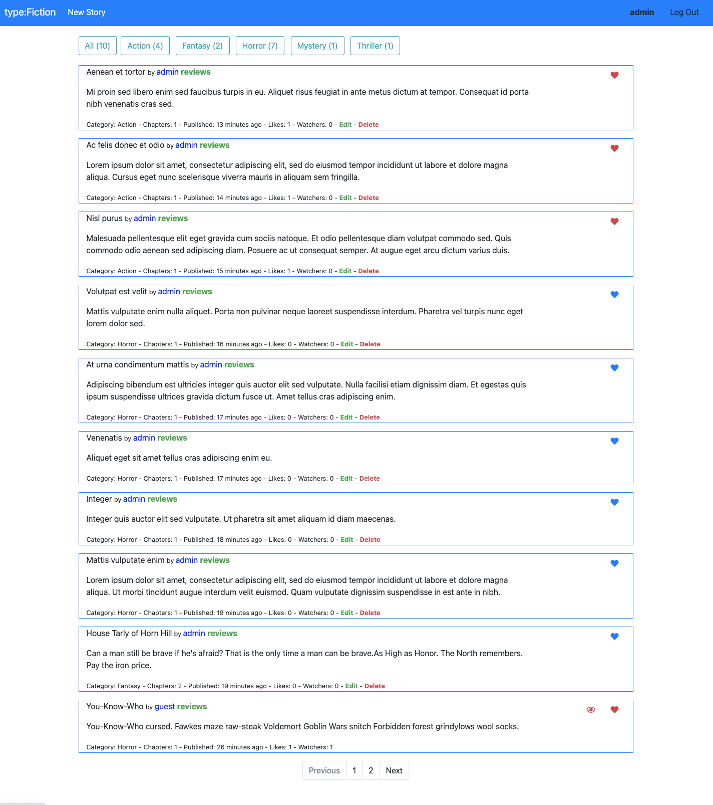

# typeFiction
An online platform for amateur writers to publish their stories.

</img>

## Project requirements
- Your web application must utilize Django (including at least one model) on the back-end and JavaScript on the front-end.
- Your web application must be mobile-responsive.
- In a README file (whose extension can be .txt, .md, .adoc, or .pdf) in your project’s main directory, include a full write-up describing your project, what’s contained in each file you created, why you made certain design decisions, and any other additional information the staff should know about your project. This document should be sufficiently thorough for your teaching fellow to run your project without any need to contact you further with questions. Take your time, and do not save this step for last.
- If you’ve added any Python packages that need to be installed in order to run your web application, be sure to add them to a requirements.txt file!

## To use the app
1. Visit [typefiction.herokuapp.com/](typefiction.herokuapp.com/) to use the website that was deployed on Heroku with Postgres as database
    - You can login as a test user:
        - username: demo
        - password: demo
1. To run the app locally, typ the following commands in your terminal:
    1. Run `python3 -m venv .env` to create a virtual environment
    1. Run `source .env/bin/activate` get into the virtual environment
    1. Run `pip3 install -r requirements.txt` to install required dependents
    1. Run `python3 manage.py makemigrations typeFiction` to make migrations for the typeFiction app
    1. Run `python3 manage.py migrate` to apply migrations to your database
    1. Run `python3 manage.py runserver` to start the server

## 🔊 Plan and processes
This project started out as an extension of my [Network project](https://github.com/abeatrix/network). The goal of this project is to utilize the skills I’ve acquired from the last four projects to build something new, which includes making API calls, creating API routes, pagination, etc. However, instead of using SQLite, I have decided to use PostgreSQL as the database. 

I wanted to use React.js for the frontend initially but realized React.js would be better used when building a single-page application, that makes me believe staying with Django templates and focus on creating reusable components with jQuery would be a better choice here. I have also done my research on designing mobile-friendly web apps and other django libraries.

## Features
- [x] PostgreSQL
- [x] jQuery
- [x] User Auth (Login, Logout)
- [x] Models/Schema
    - [x] Profile
    - [x] Story
    - [x] Chapter
    - [x] Comment
    - [x] Category
- [x] Browse and Read stories without needing to register
- [x] Submit a request to add additional categories
- [x] Post their stories to the approved categories
    - [x] Support Markdown
- [x] Edit their stories
    - [x] API Route
    - [x] UI
- [x] Delete stories 
    - [x] API Route
    - [x] UI
- [x] Edit their chapter
    - [x] API Route
    - [x] UI
- [x] Delete Chapter
    - [x] API Route
    - [x] UI
- [x] Edit their profile
    - [x] API Route
    - [x] UI
- [x] Follow/unfollow a story
- [x] Like a story
- [x] Stories can have multiple chapters
- [x] Profile Page includes:
    - [x] Username
    - [x] join date
    - [x] profile picture
    - [x] a list of their stories
    - [x] A list of stories that they are following
- [x] filter to search for stories
- [x] Comment on stories
- [ ] Save their stories draft (Stretch Goal)
- [ ] Welcome Email after account creation (Stretch Goal)
- [ ] Email verification to activate account (Stretch Goal)
- [ ] Create tags attached to their stories/post (Stretch Goal)

## File Structure
- finalproject: project directory with all the basic settings for the project
- typeFiction: app directory with all the app-related files
    - static/typefiction: static files for the app, including image files, styling files, and javascript files
    - templates/typefiction
        - components: folder that contains reusable component that includes JavaScript code for that specific component
        - normal template files

## Design Decisions
- When a user has signed up an account, a profile will be created for them automatically with a default profile picture
- All story can be created with no chapter, but only stories with chapter will be displayed publicly
- Author can edit and delete their own story and individual chapter
- Logged in users can like and unlike a story by clicking on the heart icon
    - Author can like and dislike their own story
    - This action will not trigger a reload of the page through toggling between classes via jQuery  
- Logged in users can follow different authors through their profile page
    - they cannot follow their own account
    - a list of following and followers can be found in their own profile
    - This action will not trigger a reload of the page through toggling between classes via jQuery  
- Logged in users can add stories to their watchlist by clicking on the eye icon
    - they cannot add their own story to their watchlist
    - they can find the watchlist in their profile
    - This action will not trigger a reload of the page through toggling between classes via jQuery  
- Logged in users can leave reviews for different stories
- There are 4 views (index, new, profile, story) in total apart from Auth views (register and login)
    - Index View is the main view where user can see all the submitted stories
        - There are filters on the tops where user can pick according to the category they are interested
    - New View is where user will create a new category / story
    - Profile View is where user info is displayed
        - User can also check their stats and click on the stats for more details without having the reload the page
        - Profile owner who is logged in can edit info and upload an image url as their profile picture
            - Stories is a collection of stories that the user has submitted
                - Stories created with no chapter will be displayed here, but only the profile owner can see them
            - Following is a list of authors that the profile owner follows
            - Followers is a list of username that is following the profile owner
            - Watchlist is a collection of stories that the profile owner added to their watchlist
- All the pages share the same reusable components / libraries that can be reused throughout the app
- Started as an extension of my [Network project](https://github.com/abeatrix/network)
- Category must be unique
- Stories can be filtered by Category
- Story content must be unique to avoid duplicate
- Profile Page is similar to  single-page-app 
- JavaScript is includes within each component instead of in separated static folder because I want to take advantage of the django templates tags

## 🖨 Dependents
- markdown 2
- Crispy Form
- Popper
- BootStrap
- Python
- Django
- JavaScript
- HTML5&CSS